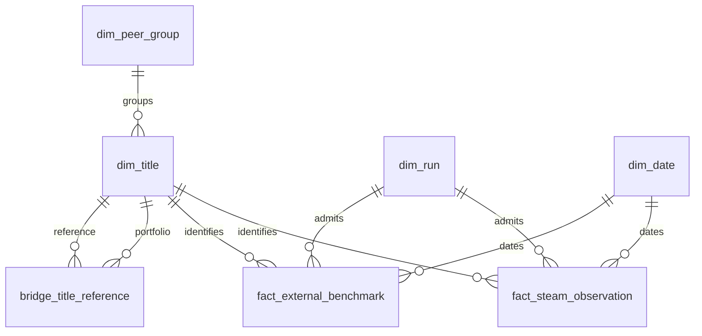

# Analytical model

## Build and release

Run `python src/build_model.py` after installing pinned dependencies. The reference runtime is Python 3.13 with SQLite 3.50.4; STRICT tables require SQLite 3.37 or newer. Exact Python/SQLite versions are recorded and included in each release fingerprint. No database service or credentials are required.

Python validates and loads records. The [schema](../sql/01_schema.sql), [reporting views](../sql/02_reporting_views.sql) and [quality gate](../sql/03_quality_checks.sql) define the shared SQL contract.

The builder validates constraints, relationships, integrity and quality checks before publishing an immutable `data/analytical/releases/<release_id>/` and updating `data/analytical/current.json`. Failed builds retain the previous pointer/release. Identical admitted inputs, SQL, builder and runtime reproduce identical keys, CSVs and database bytes.

CSV exports and the build manifest are published in Git. The local `commercial-model.sqlite` database is excluded and recreated by the same command. Read the current pointer to find the release.

## Admission

The [accepted-run register](../data/accepted-runs.json) binds each reviewed run to its source layer, acceptance evidence/time, canonical manifest hash and observation hash.

Admission requires register acceptance, passed schema-v2 status, matching reviewed hashes, complete title scope, declared CSV schema, successful source rows, valid UTC intervals and matching source/query contracts. Schema version alone cannot grant admission.

Canonical manifest hashing uses sorted JSON keys, compact separators and ASCII escaping. Observation hashing uses exact CSV bytes. The history/latest CSVs are publication conveniences, never ingestion fallbacks. Legacy/unregistered runs are excluded. Scope changes require explicit versioned admission.

## Grains

| Object | Grain / key | Purpose |
|---|---|---|
| dim_title | app_id | Curated identity/cohort; business labels retained separately |
| dim_peer_group | peer_group | Scope categories |
| dim_date | UTC calendar date | Continuous full-year calendar covering admitted intervals; ISO week/Monday start |
| dim_run | run_id | Acceptance, source/query contracts, collector revision and hashes |
| bridge_title_reference | portfolio_app_id × reference_app_id | Many-to-many role and comparison rationale |
| fact_steam_observation | app_id × run_id; unique app/time | Validated Store/review/player data and individual retrieval times |
| fact_external_benchmark | app_id × run_id × source | Estimated ownership/playtime and separately classified reported context |
| dim_metric | metric | Definition, grain, evidence class, unit, availability and limit |

Primary fact dates are collection-start UTC dates. Reporting views expose Store/review/player retrieval dates for role-specific analysis. Unobserved calendar dates are not zero activity.

## Reporting policies

`v_steam_metrics` preserves observed fields/provenance and derives GBP prices, positivity, Store-date age and lifecycle. `v_latest_steam_metrics` selects the latest admitted collection per title without joining the estimated fact.

`v_price_reference` includes only configured direct peers. Require at least three and complete same-day GBP quote coverage. Category leaders, adjacent and lifecycle references remain contextual. Missing title price or zero reference median prevents an index; counts and status accompany it.

`v_weekly_comparable_pulse` selects one title/UTC-week/review-contract observation: Monday 05:30–07:00 UTC, closest to 06:15, deterministic tie-breaks.

`v_momentum_readiness` requires four consecutive comparable weeks, the same contract and history no more than 14 days old. Three-week CCU change is undefined with a zero baseline. Net review velocity uses actual elapsed retrieval days; any cumulative-count decrease within the interval returns source_revision. Insufficient, nonconsecutive and stale history remains NULL. These are sampling policies, not statistical guarantees.

Lifecycle uses the observed Steam listed release date at Store retrieval, with raw text retained. Unparseable dates give unknown age. An observed Early Access genre flag takes precedence; otherwise launch is 0–89 days, early lifecycle 90–364, established 365–1094 and back catalogue 1095+. Negative age is pre-release. Curated labels, platform dates and age buckets remain separate.

## SQL, Python and Power BI

Query database views or consume corresponding CSVs from the same release. Do not independently recalculate definitions in each consumer.

Load title/date/run dimensions and the two facts separately with single-direction one-to-many relationships. Keep the reference bridge explicit; avoid bidirectional fact-to-fact joins. Convenience reporting-view CSVs should not duplicate base-fact measures in the same model.

Empty CSV fields represent SQL NULL; numeric zero remains 0. IDs/counts/minor-unit prices are whole numbers, reporting money/ratios are decimals, timestamps UTC and date keys dates. Retain status fields beside unavailable measures.

Ownership is unapproved estimated evidence; no midpoint or price-times-owners revenue calculation is supplied. SteamSpy price is reported in US cents and is deliberately omitted from the UK price comparison. Its previous-day peak CCU is reported observed context with an unresolved effective date; ownership/playtime evidence remains estimated. Neither field substitutes for validated current Steam players. Scenarios, promotion attribution and product recommendations belong to later deliveries.
